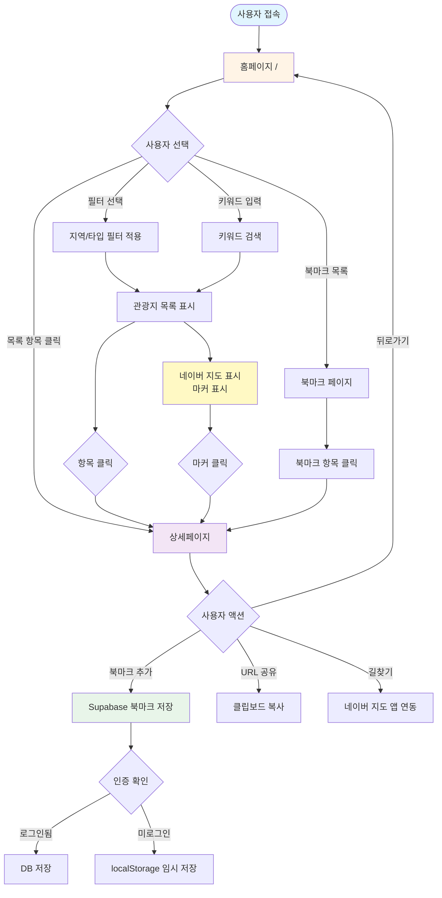
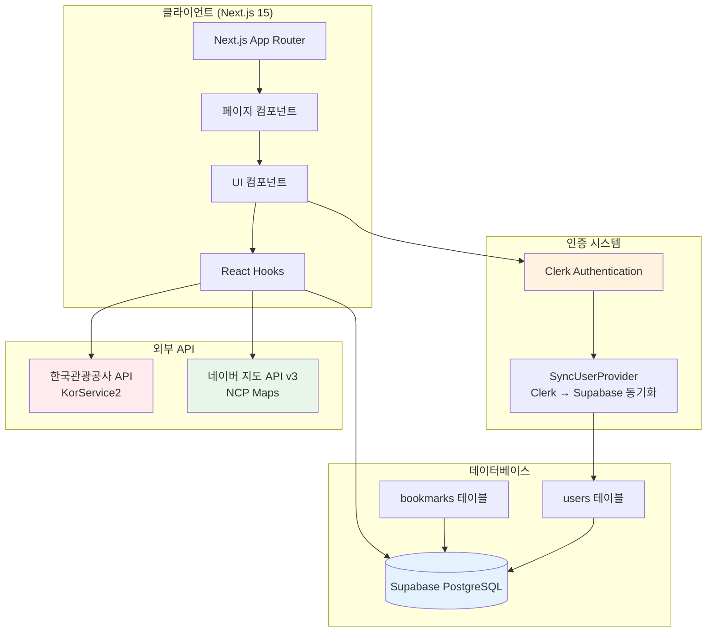
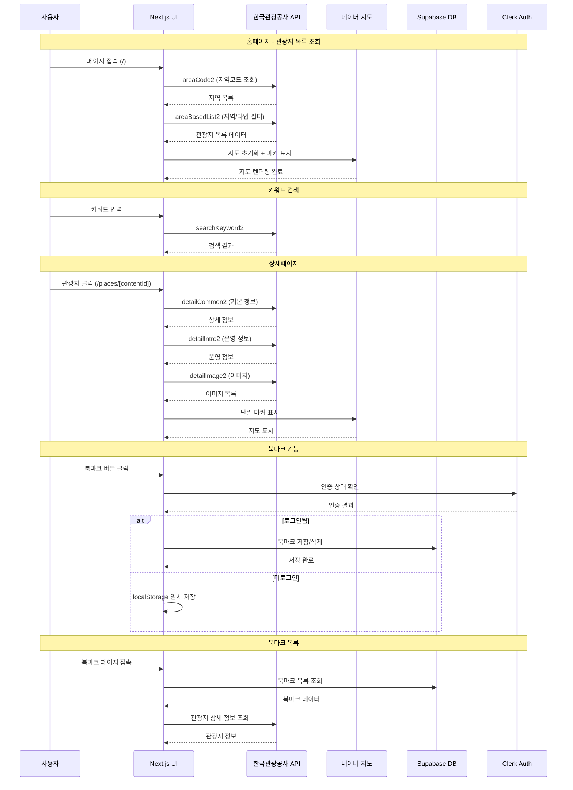
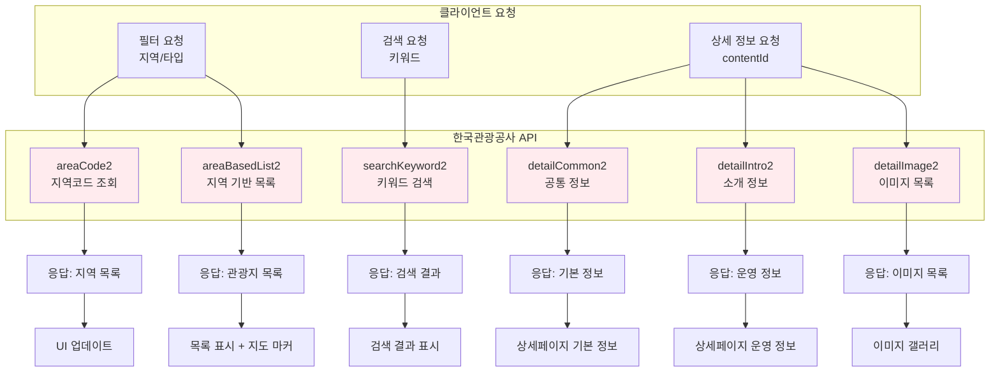
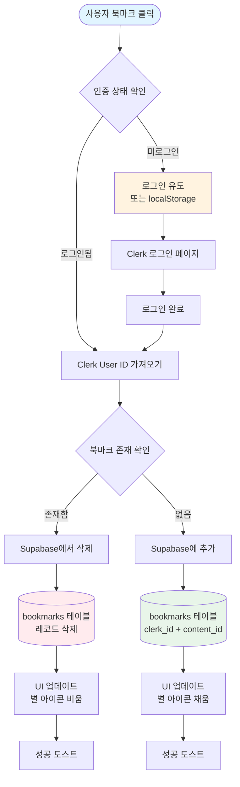
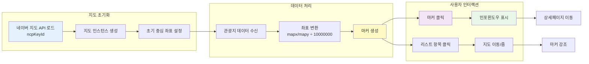

# JLG Trip 서비스 전체 흐름도

이 문서는 PRD를 기반으로 작성된 JLG Trip 서비스의 전체 흐름도를 Mermaid 다이어그램으로 표현합니다.

---

## 1. 사용자 플로우 (User Flow)



---

## 2. 시스템 아키텍처 (System Architecture)



---

## 3. 데이터 흐름 (Data Flow)



---

## 4. 페이지 구조 및 라우팅 (Page Structure)

```mermaid
graph LR
    subgraph Root["Root Layout"]
        Layout[app/layout.tsx<br/>ClerkProvider + SyncUserProvider]
    end

    subgraph Pages["페이지 라우트"]
        Home[/<br/>홈페이지<br/>목록 + 필터 + 지도]
        Detail[/places/[contentId]<br/>상세페이지]
        Bookmarks[/bookmarks<br/>북마크 목록]
        NotFound[/not-found<br/>404 페이지]
    end

    subgraph Components["공통 컴포넌트"]
        Navbar[Navbar]
        TourList[tour-list]
        TourCard[tour-card]
        TourFilters[tour-filters]
        TourSearch[tour-search]
        NaverMap[naver-map]
        DetailInfo[detail-info]
        DetailMap[detail-map]
        ShareButton[share-button]
        BookmarkButton[bookmark-button]
        BookmarkList[bookmark-list]
    end

    Layout --> Home
    Layout --> Detail
    Layout --> Bookmarks
    Layout --> NotFound

    Home --> Navbar
    Home --> TourFilters
    Home --> TourSearch
    Home --> TourList
    Home --> NaverMap
    TourList --> TourCard

    Detail --> Navbar
    Detail --> DetailInfo
    Detail --> DetailMap
    Detail --> ShareButton
    Detail --> BookmarkButton

    Bookmarks --> Navbar
    Bookmarks --> BookmarkList
    BookmarkList --> TourCard

    style Home fill:#fff4e6
    style Detail fill:#f3e5f5
    style Bookmarks fill:#e8f5e9
```

---

## 5. API 호출 흐름 (API Call Flow)



---

## 6. 북마크 기능 상세 흐름 (Bookmark Flow)



---

## 7. 지도 연동 흐름 (Map Integration Flow)



---

## 8. 컴포넌트 계층 구조 (Component Hierarchy)

```mermaid
graph TD
    Root[Root Layout]

    Root --> Navbar[Navbar<br/>검색창 + 네비게이션]

    Root --> HomePage[Home Page /]
    Root --> DetailPage[Detail Page /places/[contentId]]
    Root --> BookmarkPage[Bookmark Page /bookmarks]

    HomePage --> Filters[TourFilters<br/>지역/타입 필터]
    HomePage --> Search[TourSearch<br/>키워드 검색]
    HomePage --> Content[Content Area]

    Content --> List[TourList]
    Content --> Map[NaverMap]

    List --> Card1[TourCard]
    List --> Card2[TourCard]
    List --> Card3[TourCard]
    List --> Pagination[TourPagination]

    DetailPage --> DetailInfo[DetailInfo<br/>기본 정보]
    DetailPage --> DetailIntro[DetailIntro<br/>운영 정보]
    DetailPage --> DetailGallery[DetailGallery<br/>이미지 갤러리]
    DetailPage --> DetailMap[DetailMap<br/>지도]
    DetailPage --> ShareButton[ShareButton<br/>URL 복사]
    DetailPage --> BookmarkButton[BookmarkButton<br/>북마크]

    BookmarkPage --> BookmarkList[BookmarkList]
    BookmarkList --> BookmarkCard1[TourCard]
    BookmarkList --> BookmarkCard2[TourCard]

    style Root fill:#e1f5ff
    style HomePage fill:#fff4e6
    style DetailPage fill:#f3e5f5
    style BookmarkPage fill:#e8f5e9
    style Map fill:#fff9c4
```

---

## 다이어그램 설명

### 1. 사용자 플로우

사용자가 서비스를 이용하는 전체 과정을 단계별로 표현합니다.

### 2. 시스템 아키텍처

클라이언트, 인증 시스템, 외부 API, 데이터베이스 간의 관계를 보여줍니다.

### 3. 데이터 흐름

시퀀스 다이어그램으로 각 기능별 API 호출과 데이터 흐름을 시간 순서대로 표현합니다.

### 4. 페이지 구조 및 라우팅

Next.js App Router 기반의 페이지 구조와 컴포넌트 관계를 보여줍니다.

### 5. API 호출 흐름

한국관광공사 API의 각 엔드포인트와 사용 시나리오를 표현합니다.

### 6. 북마크 기능 상세 흐름

북마크 추가/삭제 시 인증 확인부터 데이터 저장까지의 상세 과정을 보여줍니다.

### 7. 지도 연동 흐름

네이버 지도 API 초기화부터 마커 표시, 사용자 인터랙션까지의 흐름을 표현합니다.

### 8. 컴포넌트 계층 구조

React 컴포넌트의 계층적 구조와 부모-자식 관계를 보여줍니다.

---

## 참고사항

- 모든 다이어그램은 Mermaid 문법으로 작성되었습니다
- GitHub, GitLab, Notion, VS Code 등에서 Mermaid를 지원하는 환경에서 렌더링 가능합니다
- 각 다이어그램은 독립적으로 이해할 수 있도록 구성되었습니다
